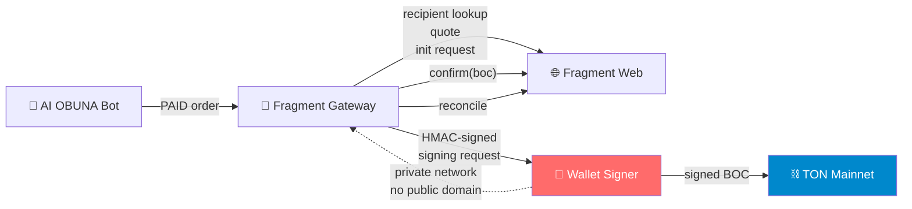
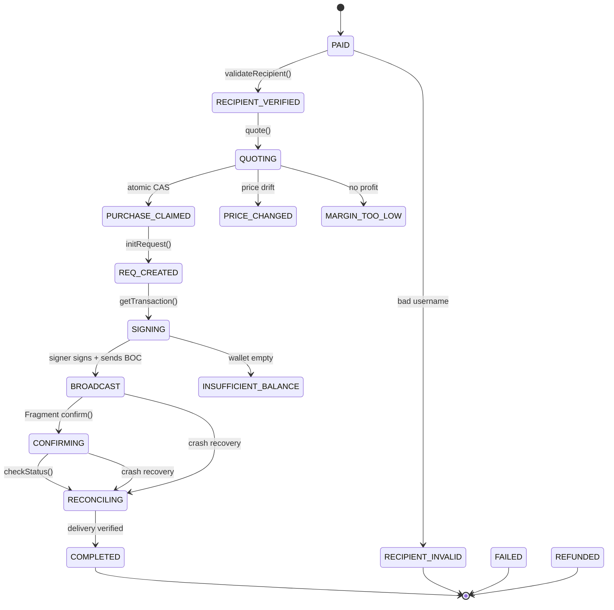

# Fragment Operations — Direct Gateway + TON Wallet Signer

Operational guide for the Fragment integration in AI OBUNA.

> [!CAUTION]
> Never paste seed phrases, private keys, session cookies, or Telegram login
> codes in chat, code, or git. All secrets go exclusively to Railway Variables.

---

## Architecture



**Three isolated services:**

| Service | Role | Secrets |
|:---|:---|:---|
| AI OBUNA | Bot + admin panel | Bot token, Payme/Click keys |
| Fragment Gateway | Fragment session, API calls | Fragment session (encrypted) |
| Wallet Signer | Signs TON transactions | Wallet mnemonic (Railway only) |

---

## Environment Variables

### Fragment Gateway

| Variable | Required | Description |
|:---|:---|:---|
| `FRAGMENT_ENABLED` | Yes | `"1"` to enable, `"0"` to disable |
| `FRAGMENT_MODE` | Yes | `off` / `shadow` / `canary` / `live` |
| `FRAGMENT_LOGIN_PHONE` | Yes | Phone for Fragment Telegram account |
| `FRAGMENT_SESSION_ENCRYPTION_KEY` | Yes | 64 hex chars (32 bytes) |
| `FRAGMENT_SIGNER_URL` | Yes | Internal signer URL |
| `FRAGMENT_SIGNER_SHARED_SECRET` | Yes | HMAC secret for Gateway→Signer |
| `FRAGMENT_CANARY_USERNAME` | Canary | Test recipient username |

### TON Wallet Signer

| Variable | Required | Description |
|:---|:---|:---|
| `TON_HOT_WALLET_MNEMONIC` | Yes | 24-word seed phrase (Railway only!) |
| `TON_HOT_WALLET_ADDRESS` | Yes | Public wallet address (UQ...) |
| `TON_WALLET_VERSION` | No | Auto-detected from mnemonic |
| `TON_RPC_ENDPOINT` | No | Defaults to toncenter mainnet |
| `TON_RPC_API_KEY` | No | For toncenter rate limit bypass |

### Spend Limits

| Variable | Default | Description |
|:---|:---|:---|
| `FRAGMENT_MIN_HOT_WALLET_BALANCE_TON` | `0.5` | Reserve that must stay in wallet |
| `FRAGMENT_MAX_SINGLE_PURCHASE_TON` | `50` | Max TON per purchase |
| `FRAGMENT_DAILY_SPEND_LIMIT_TON` | `200` | Max TON per day |

---

## Fragment Modes

### `off` — Disabled
No Fragment automation. Stars/Premium sold via manual delivery.

### `shadow` — Dry Run
- ✅ Session auth
- ✅ Recipient lookup
- ✅ Quote from Fragment
- ✅ Init request + get transaction payload
- ❌ No TON signing
- ❌ No broadcast
- ❌ No real purchases

Use shadow to validate the entire pipeline without spending TON.

### `canary` — Single Test Recipient
- Only purchases for `FRAGMENT_CANARY_USERNAME` are processed
- All other Fragment orders stay in manual delivery
- Requires explicit admin confirmation before first purchase

### `live` — Full Production
All Fragment orders processed automatically.

---

## Session Setup

### Initial Login

```
Railway → Fragment Gateway → Variables:
  FRAGMENT_LOGIN_PHONE = "+998XXXXXXXXX"
  FRAGMENT_SESSION_ENCRYPTION_KEY = <generate with:
    node -e "console.log(require('crypto').randomBytes(32).toString('hex'))"
  >
```

Then use the bot admin command `/fragauth` which:
1. Opens Fragment login page
2. Sends code to the dedicated Telegram account
3. Owner confirms in Telegram
4. Session cookies are encrypted and stored in DB

### Re-authentication

If the session expires (admin alert sent automatically):
1. Run `/fragauth` again
2. Confirm in Telegram
3. No code changes needed

### Session Health

Check via `/fraghealth` or the admin panel health endpoint.

---

## Wallet Management

### Hot Wallet

Address: configured in `TON_HOT_WALLET_ADDRESS`

**Refill procedure:**
1. Check balance via `/fraghealth`
2. Transfer TON from cold wallet to hot wallet address
3. Keep 1-2 days of trading volume, no more

**Security:**
- Mnemonic lives ONLY in Railway Variables
- Hot wallet holds only operational balance
- Cold wallet never touches the server

### Adding Mnemonic

```
Railway → Wallet Signer service → Variables:
  TON_HOT_WALLET_MNEMONIC = "word1 word2 ... word24"
```

After adding, write **"ГОТОВО"** in chat. The code only checks `SET / NOT SET`.

---

## Order State Machine



### Critical Invariant

**ONE PAID ORDER = MAX ONE FRAGMENT PURCHASE**

The `SupplierPurchase` table enforces `UNIQUE(orderId, supplier)`.
Atomic CAS transitions `PAID → PURCHASE_CLAIMED` prevent double-buy.

---

## Emergency Procedures

### Kill Switch

```
Railway → Fragment Gateway → Variables:
  FRAGMENT_ENABLED = "0"
```

Effect:
- New Fragment orders → manual delivery
- Signer → rejects new requests
- Reconciliation of already-broadcast transactions continues

### Session Expired

1. Admin receives Telegram alert
2. Run `/fragauth`
3. Confirm in Telegram

### Wallet Balance Low

1. Admin receives Telegram alert when balance < `FRAGMENT_MIN_HOT_WALLET_BALANCE_TON`
2. Transfer TON from cold wallet

### Fragment Protocol Changed

If Fragment changes their web interface:
1. Automatic `PROTOCOL_UNHEALTHY` detection
2. Admin alert sent
3. Set `FRAGMENT_ENABLED=0`
4. Orders fallback to manual delivery
5. Update code to match new protocol

---

## Reconciliation

After any crash or restart, the reconciler picks up unfinished purchases:

| State at crash | Recovery action |
|:---|:---|
| `PAID` | Safe retry from beginning |
| `RECIPIENT_VERIFIED` | Safe retry |
| `QUOTING` | Safe retry |
| `PURCHASE_CLAIMED` | Safe retry (no TON spent) |
| `REQ_CREATED` | Safe retry |
| `SIGNING` | Check TON chain for broadcast |
| `BROADCAST` | Check TON chain + Fragment status |
| `CONFIRMING` | Check Fragment status |
| `RECONCILING` | Continue checking |

> [!WARNING]
> After `SIGNING` state, NEVER start a new purchase. Only reconcile.

---

## Health Check

`/fraghealth` shows:

- Fragment session status
- Fragment protocol health
- TON signer reachability
- TON RPC reachability
- Wallet balance
- Fragment mode
- Pending / reconciling / failed purchases
- Today's TON spend
